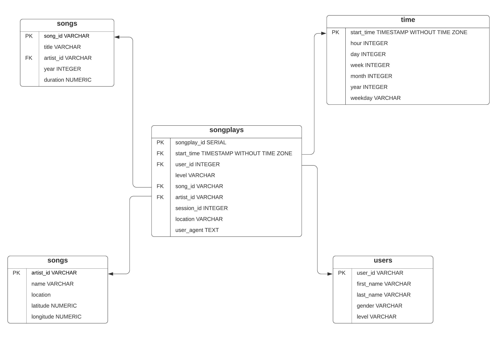

# Data Modeling with Postgres
<br></br>
## Sparkify Project Introduction 
As data engineer, we create a Sparkify database, tabeles, and ETL pipeline for analysis. In this project, a star schema is implemented for defining  fact and dimension tables so we can focus a specific analytic. Order to complete a project, ETL pipeline is written for transferring data from JSON files local directories into created tables in Postgres by using Python and SQL.
<br></br>

## Database schema design:
With  song and log datasets , a database (sparkifydb) Star schema was designed for ETL process and optimized for queries on song play analysis
The database include one fact and four dimension tables:

#### 1.Fact Table is:
* >**songplays:** records in log data associated with song plays(page NextSong)  

<br></br>
#### 2. Dimension Tables are: 
* >**users:** users in the app   
* >**songs:** songs in music database
* >**artists:** artists in music database
* >**time:** timestamps of records in songplays broken down into specific units

<br></br>
#### 3. ER Diagram displays the relationship between the fact and dimension tables


<br></br>
## ETL process
#### How to run the project with Python files 


<u>**Python**</u>
* >**create_tables.py:** connect database, drops, creates, and reset tables before each time we run ETL scripts. We run this script on the notebook test.ipynb(%run create_tables.py)

* >**etl.py:** script has the functionality almost like etl.ipynb notebook. It reads and processes files from song_data and log_data and loads them loads the data into fact and dimension tables- etl.py mainly does process data from log and song file. We run the script on the notebook test.ipynb(%run etl.py)

* >**sql_queries.py:** all sql queries were designed for create, insert, and select tables so that we can load data from JSON files and insert/select into/from tables. 
<br></br> 
<u>**Notebook**</u>
* >**etl.ipynb:** this notebook process ETL of each table with detailed instruction by reading and processesing each file from song_data and log_data and loads the data into fact and dimension tables.
* >**test.ipynb:** checks if the database and its tables run correctly. 


# Files in repository:
```
.
├── create_tables.py
├── data
│   ├── log_data
│   │   └── 2018
│   │       └── 11
│   │           ├── 2018-11-01-events.json
│   │           ├── 2018-11-02-events.json
│   │           ├── 2018-11-03-events.json
│   │           ├── 2018-11-04-events.json
│   │           ├── 2018-11-05-events.json
│   │           ├── 2018-11-06-events.json
│   │           ├── 2018-11-07-events.json
│   │           ├── 2018-11-08-events.json
│   │           ├── 2018-11-09-events.json
│   │           ├── 2018-11-10-events.json
│   │           ├── 2018-11-11-events.json
│   │           ├── 2018-11-12-events.json
│   │           ├── 2018-11-13-events.json
│   │           ├── 2018-11-14-events.json
│   │           ├── 2018-11-15-events.json
│   │           ├── 2018-11-16-events.json
│   │           ├── 2018-11-17-events.json
│   │           ├── 2018-11-18-events.json
│   │           ├── 2018-11-19-events.json
│   │           ├── 2018-11-20-events.json
│   │           ├── 2018-11-21-events.json
│   │           ├── 2018-11-22-events.json
│   │           ├── 2018-11-23-events.json
│   │           ├── 2018-11-24-events.json
│   │           ├── 2018-11-25-events.json
│   │           ├── 2018-11-26-events.json
│   │           ├── 2018-11-27-events.json
│   │           ├── 2018-11-28-events.json
│   │           ├── 2018-11-29-events.json
│   │           └── 2018-11-30-events.json
│   └── song_data
│       └── A
│           ├── A
│           │   ├── A
│           │   │   ├── TRAAAAW128F429D538.json
│           │   │   ├── TRAAABD128F429CF47.json
│           │   │   ├── TRAAADZ128F9348C2E.json
│           │   │   ├── TRAAAEF128F4273421.json
│           │   │   ├── TRAAAFD128F92F423A.json
│           │   │   ├── TRAAAMO128F1481E7F.json
│           │   │   ├── TRAAAMQ128F1460CD3.json
│           │   │   ├── TRAAAPK128E0786D96.json
│           │   │   ├── TRAAARJ128F9320760.json
│           │   │   ├── TRAAAVG12903CFA543.json
│           │   │   └── TRAAAVO128F93133D4.json
│           │   ├── B
│           │   │   ├── TRAABCL128F4286650.json
│           │   │   ├── TRAABDL12903CAABBA.json
│           │   │   ├── TRAABJL12903CDCF1A.json
│           │   │   ├── TRAABJV128F1460C49.json
│           │   │   ├── TRAABLR128F423B7E3.json
│           │   │   ├── TRAABNV128F425CEE1.json
│           │   │   ├── TRAABRB128F9306DD5.json
│           │   │   ├── TRAABVM128F92CA9DC.json
│           │   │   ├── TRAABXG128F9318EBD.json
│           │   │   ├── TRAABYN12903CFD305.json
│           │   │   └── TRAABYW128F4244559.json
│           │   └── C
│           │       ├── TRAACCG128F92E8A55.json
│           │       ├── TRAACER128F4290F96.json
│           │       ├── TRAACFV128F935E50B.json
│           │       ├── TRAACHN128F1489601.json
│           │       ├── TRAACIW12903CC0F6D.json
│           │       ├── TRAACLV128F427E123.json
│           │       ├── TRAACNS128F14A2DF5.json
│           │       ├── TRAACOW128F933E35F.json
│           │       ├── TRAACPE128F421C1B9.json
│           │       ├── TRAACQT128F9331780.json
│           │       ├── TRAACSL128F93462F4.json
│           │       ├── TRAACTB12903CAAF15.json
│           │       ├── TRAACVS128E078BE39.json
│           │       └── TRAACZK128F4243829.json
│           └── B
│               ├── A
│               │   ├── TRABACN128F425B784.json
│               │   ├── TRABAFJ128F42AF24E.json
│               │   ├── TRABAFP128F931E9A1.json
│               │   ├── TRABAIO128F42938F9.json
│               │   ├── TRABATO128F42627E9.json
│               │   ├── TRABAVQ12903CBF7E0.json
│               │   ├── TRABAWW128F4250A31.json
│               │   ├── TRABAXL128F424FC50.json
│               │   ├── TRABAXR128F426515F.json
│               │   ├── TRABAXV128F92F6AE3.json
│               │   └── TRABAZH128F930419A.json
│               ├── B
│               │   ├── TRABBAM128F429D223.json
│               │   ├── TRABBBV128F42967D7.json
│               │   ├── TRABBJE12903CDB442.json
│               │   ├── TRABBKX128F4285205.json
│               │   ├── TRABBLU128F93349CF.json
│               │   ├── TRABBNP128F932546F.json
│               │   ├── TRABBOP128F931B50D.json
│               │   ├── TRABBOR128F4286200.json
│               │   ├── TRABBTA128F933D304.json
│               │   ├── TRABBVJ128F92F7EAA.json
│               │   ├── TRABBXU128F92FEF48.json
│               │   └── TRABBZN12903CD9297.json
│               └── C
│                   ├── TRABCAJ12903CDFCC2.json
│                   ├── TRABCEC128F426456E.json
│                   ├── TRABCEI128F424C983.json
│                   ├── TRABCFL128F149BB0D.json
│                   ├── TRABCIX128F4265903.json
│                   ├── TRABCKL128F423A778.json
│                   ├── TRABCPZ128F4275C32.json
│                   ├── TRABCRU128F423F449.json
│                   ├── TRABCTK128F934B224.json
│                   ├── TRABCUQ128E0783E2B.json
│                   ├── TRABCXB128F4286BD3.json
│                   └── TRABCYE128F934CE1D.json
├── etl.ipynb
├── etl.py
├── __pycache__
│   └── sql_queries.cpython-36.pyc
├── README.md
├── sql_queries.py
└── test.ipynb
```


